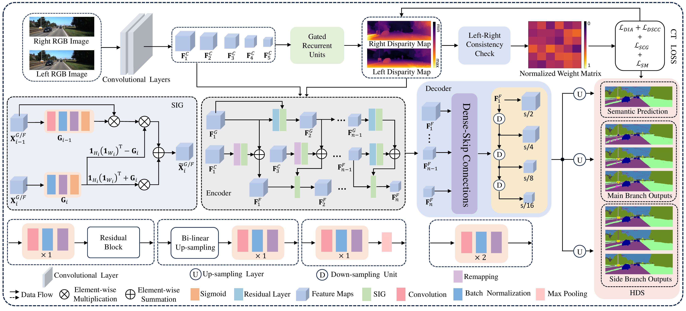

# TiCoSS: Tightening the Coupling between Semantic Segmentation and Stereo Matching within A Joint Learning Framework

---

**[Paper](https://arxiv.org/abs/2407.18038)** | **[Weights](https://huggingface.co/)**

This is the official implementation for **TiCoSS**:

> TiCoSS: Tightening the Coupling between Semantic Segmentation and Stereo Matching within A Joint Learning Framework

> Guanfeng Tang, Zhiyuan Wu, Jiahang Li, Ping Zhong, Wei Ye, Xieyuanli Chen, Huimin Lu and Rui Fan

## Abstract

Semantic segmentation and stereo matching are two central perception tasks for autonomous driving. TiCoSS studies how to strengthen their interaction in a joint learning framework rather than treating them as separate pipelines. The method introduces tightly coupled gated feature fusion, hierarchical deep supervision, and coupling-oriented losses so that contextual semantic cues and geometric stereo cues can reinforce each other. Experiments on KITTI and vKITTI2 show that this tighter coupling improves both qualitative and quantitative performance, especially semantic segmentation accuracy.

## Overview

<p align="center">
  
</p>

<p align="center">
  <em>The architecture of our proposed TiCoSS for end-to-end joint learning of semantic segmentation and stereo matching.</em>
</p>

The original overview figure is also available as [figs/baseline.pdf](figs/baseline.pdf).

## Contributions

In summary, the main contributions of this article include:

- The TGF strategy, which propagates useful contextual and geometric information from the preceding layer to the current layer, enabling more effective feature fusion for semantic segmentation;
- The HDS strategy, which uses the fused features with the richest local spatial details to guide deep supervision across each branch;
- The DIA loss and the DSCC loss that tighten the coupling between the two tasks, thereby further improving the semantic segmentation performance.

## Installation
The main package versions are:

| Package | Version |
| --- | --- |
| Python | 3.10.18 |
| PyTorch | 2.8.0+cu128 |
| torchvision | 0.23.0+cu128 |
| NumPy | 2.0.1 |
| OpenCV | 4.12.0 |
| Pillow | 11.1.0 |
| SciPy | 1.15.2 |
| scikit-learn | 1.7.2 |
| scikit-image | 0.25.2 |
| imageio | 2.37.0 |
| tqdm | 4.66.4 |
| matplotlib | 3.10.1 |
| tensorboard | 2.20.0 |

Example setup:

```bash
conda create -n ticoss python=3.10 -y
conda activate ticoss

pip install torch torchvision --index-url https://download.pytorch.org/whl/cu128
pip install numpy opencv-python pillow scipy scikit-learn scikit-image imageio tqdm matplotlib tensorboard
```

## Dataset Preparation

Prepare the KITTI-style joint semantic segmentation and stereo matching dataset as follows:

```text
myKITTI_sem/
├── image_2/
│   ├── training/
│   │   ├── 000000_10.png
│   │   └── ...
│   └── validation/
├── image_3/
│   ├── training/
│   │   ├── 000000_10.png
│   │   └── ...
│   └── validation/
├── disp_occ_0/
│   ├── training/
│   │   ├── 000000_10.png
│   │   └── ...
│   └── validation/
└── semantic_rgb/
    ├── training/
    │   ├── 000000_10.png
    │   └── ...
    └── validation/
```

The current training command expects the dataset root to be passed via `--data_root`, for example:

```bash
/path/to/kitti
```

## Checkpoints

The official weights of our model **TiCoSS** can be downloaded from [Hugging Face](https://huggingface.co/) after release. Model weights should be hosted on Hugging Face rather than committed to GitHub.

Expected local paths:

```text
checkpoints/checkpoint.pth      # inference/demo checkpoint
vkitti_pretrained.pth           # training initialization checkpoint
```

Large weight files such as `*.pth` are ignored by `.gitignore`.

## Training

```bash
python train.py \
  --train_datasets kitti \
  --data_root /path/to/kitti \
  --batch_size 1 \
  --image_size 256 512 \
  --num_steps 20000 \
  --name exp
```

The final model will be saved to:

```text
checkpoints/exp.pth
```

## Demo

Run inference on a stereo pair:

```bash
python demo.py \
  --left ./demo_figures/left.png \
  --right ./demo_figures/right.png \
  --save
```

Saved outputs:

```text
results/left_disp.png
results/left_seg.png
```

You can also use [demo.ipynb](demo.ipynb) for interactive inference and visualization.

## Citation

If you find this work useful, please cite:

```bibtex
@ARTICLE{11072253,
  author={Tang, Guanfeng and Wu, Zhiyuan and Li, Jiahang and Zhong, Ping and Ye, Wei and Chen, Xieyuanli and Lu, Huimin and Fan, Rui},
  journal={IEEE Transactions on Automation Science and Engineering}, 
  title={TiCoSS: Tightening the Coupling Between Semantic Segmentation and Stereo Matching Within a Joint Learning Framework}, 
  year={2025},
  volume={22},
  number={},
  pages={18646-18658},
  doi={10.1109/TASE.2025.3586286}}
}
```
